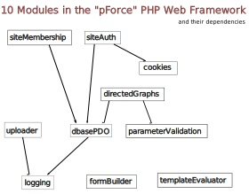

# pForce
A thin Framework for PHP (including site logins).  Formerly used by the parent project BrainAnnex.org and other web sites/web apps.

Use only what you need: pForce doesn't twist your arm to program your web app in any particular way! (In the spirit of Flask, in the Python world.)

pForce: **May the *PHP* Force be with you!**

The pForce Framework was originally developed as part of the "Brain Annex" project, but - as of version 4.0 - is now independent of it, and now no longer used by it.

This framework has been in active, continuous use on multiple web apps for years - some components for about a decade - and has been *released to Open Source* in Oct. 2019 as version 4.0

It is very modular, and it currently contains 10 components, with no external dependencies.

**Note: this framework is no longer actively maintained. Its last update was in Apr. 2020, with version 4.2.  The parent project, "Brain Annex" (https://brainannex.org), was ported to Python/Flask.** 

# [DOCUMENTATION](https://brainannex.github.io/pForce/)

# 10 Components

## *cookies*

Static class to handle COOKIES 

 

## *dbasePDO*

Class for DATABASE-INTERFACE using the PDO functions   

 

## *directedGraphs*

Class to implement a Traversable Directed Acyclic Graph (DAG), consisting of Nodes and Directional Edges between 2 Node.
Each node can carry a set of user-defined "semantics" (such as "name" and "remarks"); likewise for each edges (for example "childSequenceNo") 

 

## *formBuilder*

Classes to easily build HTML forms, as well as "Control Panels" consisting of a table of such forms (each of which is referred to as a "pane").

2 CLASSES:  "controlPanel" and "formBuilder" 

 

## *logging*

Class to log SYSTEM MESSAGES (such as alerts or diagnostics) into a text file or an HTML file

 

## *parameterValidation*

Class with static functions for PARAMETER VALIDATION

 

## *siteAuth*

Class for SITE USER AUTHENTICATION, incl. login/logout management.
Multiple independent websites are supported.

 

## siteMembership

Class for the management of generic user accounts on a site: the underlying database table could have more fields, used by other more site-specific modules
Based on the entity "User-access ID" : identifying a particular membership for some user

 

## *templateEvaluator*

Class for Template Evaluation: bare-bones counterpart of the Python library "Jinja"

## *uploader*

Class to facilitate File Uploads

# [DOCUMENTATION](https://brainannex.github.io/pForce)

# pForce Versions and Change Log

Important: pForce is no longer actively supported.   The parent project, Brain Annex (https://brainannex.org), was ported to python/Flask and graph databases.

4.2  (Apr. 17,  2020)

In class  directedGraph , added public method numberParents($nodeID)
4.1  (Dec. 13,  2019)

In class dbasePDO, the 2nd argument of the method countRecords is now optional
Hotfix to bug in the  addNewAccount  method of the   siteMembership  class, in file  siteMembership/siteMembership.php
4.0.1  (Oct. 4,  2019)

Hotfix to bug in the pdo_num_rows method of class dbasePDO, and tweaks to the logging class
4.0  (Oct. 1,  2019)

Initial Release to Open Source, and start of an independent existance from the Brain Annex project
3.0  (June 14,  2018)

Released as a set of components inside the Brain Annex web app
2.0  (Sep. 29,  2017)

Released as a set of components inside the Brain Annex web app
1.0  (June 4,  2015)

Released as a set of components inside the Brain Annex web app
 

NOTE: several modules that eventually became part of the pForce Framework had been developed years before, for various web sites.  They got incorporated into the Brain Annex web app as of v. 1.0
